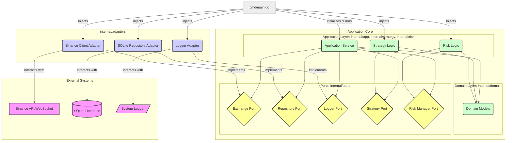

# System Patterns: Crypto Trading Bot

## System Architecture: Clean Architecture (Ports & Adapters)

The application follows the Clean Architecture pattern, also known as Ports & Adapters or Hexagonal Architecture. This promotes separation of concerns, testability, and independence from external frameworks and dependencies.



### Component Breakdown (Layers)
1.  **Domain Layer (`internal/domain`)**: Contains the core business entities and value objects (e.g., `Position`, `Trade`, `Kline`). This layer has no dependencies on other layers.
2.  **Application Layer (`internal/app`, `internal/strategy`, `internal/risk`)**: Orchestrates the use cases of the application. It contains the main `Service`, `Strategy` logic, and `Risk` management logic. It depends on the Domain Layer and defines the Ports (interfaces) it needs to interact with the outside world.
3.  **Ports (`internal/ports`)**: Defines the interfaces (ports) that the Application Layer uses to communicate with external systems or infrastructure. Examples include `Repository`, `Exchange`, `Logger`, `Strategy`, `RiskManager`.
4.  **Adapters Layer (`internal/adapters`)**: Implements the Ports interfaces, acting as bridges between the Application Layer and external systems/tools (e.g., Binance API, SQLite database, system logger). Adapters depend on the Ports they implement and the external libraries/APIs they interact with.
5.  **Infrastructure/Entry Point (`cmd/`, `main.go`, `config/`)**: Initializes the application, performs dependency injection (wiring up adapters to ports and injecting them into the service), loads configuration, and starts the application execution.

## Key Technical Decisions

### Language Choice: Go
- **Rationale**: Go provides excellent concurrency support via goroutines, which is essential for handling WebSocket connections and multiple simultaneous operations
- **Benefits**: Strong typing, good performance, built-in concurrency primitives
- **Trade-offs**: Less extensive library ecosystem compared to some languages, steeper learning curve than scripting languages

### Database: SQLite
- **Rationale**: Lightweight, serverless database that doesn't require separate installation
- **Benefits**: Simple setup, file-based storage, ACID compliance
- **Trade-offs**: Limited concurrency support, not suitable for distributed systems

### API Integration: go-binance Library
- **Rationale**: Official Go client for Binance API with comprehensive feature support
- **Benefits**: Well-maintained, handles WebSocket connections, supports all required API endpoints
- **Trade-offs**: Dependency on external library maintenance

### Configuration: Environment Variables
- **Rationale**: Standard approach for configuration that works well with containerization
- **Benefits**: Easy to change without code modifications, works well with Docker
- **Trade-offs**: Limited type safety, requires documentation for users

## Design Patterns

### Dependency Injection / Singleton-like Behavior
- **Usage**: Adapters (Database connection, Binance API client, Logger) are typically instantiated once at startup (`cmd/main.go`).
- **Implementation**: Instances are created in `main.go` and injected into the `Application Service` and potentially other components that need them, following the Dependency Injection pattern. This achieves singleton-like behavior for these shared resources without using global singletons.
- **Benefit**: Promotes testability (mocks can be injected), manages resource lifecycle, avoids global state.

### Repository Pattern
- **Usage**: Database access abstraction.
- **Implementation**: Defined by the `Repository` interface in `internal/ports` and implemented by the `SQLite Repository Adapter` in `internal/adapters/sqlite`.
- **Benefit**: Decouples the Application Layer from specific database technology (SQLite). Allows swapping database implementations easily.

### Observer Pattern (Implicit via Callbacks/Channels)
- **Usage**: Handling real-time WebSocket price updates from the Binance Adapter.
- **Implementation**: The `Binance Client Adapter` likely uses callbacks or channels (provided by the `Application Service` during setup) to push incoming price data/events into the Application Layer for processing.
- **Benefit**: Decouples the Application Layer from the specifics of WebSocket handling in the adapter.

### Strategy Pattern
- **Usage**: Trading strategy implementation (`internal/strategy`).
- **Implementation**: Defined by the `Strategy` interface in `internal/ports` (or within the strategy module itself). Specific strategies (e.g., `MACrossover`) implement this interface. The `Application Service` uses the selected strategy implementation via its interface.
- **Benefit**: Allows different trading algorithms to be developed, tested (backtesting), optimized, and plugged into the application interchangeably.

## Layer Interactions (Dependency Rule: Arrows point inwards)

- **`cmd/main.go` → Adapters, Service, Ports**: Initializes adapters and the core service, injecting adapter instances (which implement ports) into the service.
- **Service (`internal/app`) → Ports (`internal/ports`), Domain (`internal/domain`)**: Uses interfaces (Ports) to interact with external concerns (database, exchange) and operates on Domain models.
- **Adapters (`internal/adapters`) → Ports (`internal/ports`), External Systems**: Implement the Port interfaces and interact directly with external libraries/APIs (e.g., go-binance, go-sqlite3).
- **Domain (`internal/domain`) → (Nothing)**: Has no dependencies on other layers.

## Critical Implementation Paths

### Trade Execution Path (Clean Architecture Flow)
1. **Binance Adapter (`adapters/binanceclient`)**: Receives price update via WebSocket.
2. **Binance Adapter**: Pushes update to `Application Service` (via callback/channel, implementing `ExchangePort`'s notification mechanism).
3. **Application Service (`app/service`)**: Receives update.
4. **Application Service**: Consults `Strategy Logic` (via `StrategyPort`).
5. **Strategy Logic (`strategy/`)**: Evaluates conditions using current/historical data (potentially fetched via `RepositoryPort`). Returns entry/exit signal.
6. **Application Service**: If entry signal, consults `Risk Logic` (via `RiskPort`) for position sizing and checks.
7. **Application Service**: If approved, calls `ExchangePort` to place market order, SL/TP orders.
8. **Binance Adapter**: Executes orders via Binance API.
9. **Binance Adapter**: Receives order confirmation.
10. **Binance Adapter**: Notifies `Application Service` of confirmation.
11. **Application Service**: Calls `RepositoryPort` to record/update position in database.
12. **SQLite Adapter (`adapters/sqlite`)**: Persists data to SQLite database.

### Position Management Path (Clean Architecture Flow)
1. **Binance Adapter**: Receives price update.
2. **Binance Adapter**: Pushes update to `Application Service`.
3. **Application Service**: Retrieves current open position(s) via `RepositoryPort`.
4. **Application Service**: Compares current price to position's SL/TP levels.
5. **Application Service**: If SL/TP hit, calls `ExchangePort` to close position.
6. **Binance Adapter**: Executes close order via Binance API.
7. **Binance Adapter**: Receives confirmation.
8. **Binance Adapter**: Notifies `Application Service`.
9. **Application Service**: Calculates PnL, calls `RepositoryPort` to update position status and record trade history.
10. **SQLite Adapter**: Persists changes to database.

### Error Handling Path (Clean Architecture Flow)
1. **Adapter (e.g., `BinanceClient`, `SQLiteRepo`)**: Encounters error interacting with external system.
2. **Adapter**: Wraps error with context (`fmt.Errorf`) and returns it, satisfying the `Port` interface contract.
3. **Application Service**: Receives error from the Port.
4. **Application Service**: Logs the error via `LoggerPort`.
5. **Application Service**: Attempts recovery or makes decisions based on error type (e.g., retry, shutdown).
6. **Logger Adapter**: Writes log message to the configured output (e.g., stdout).

## Data Flow

### Market Data Flow
```
Binance WebSocket → Binance Adapter → Application Service → Strategy Logic / Position Management
```

### Order Flow
```
Application Service → Exchange Port → Binance Adapter → Binance API → Binance Adapter → Application Service → Repository Port → SQLite Adapter → Database
```

### Configuration Flow
```
.env File → Config Loader (`config/`) → Config Struct → Injected into Service/Adapters (`cmd/main.go`)
```

## Concurrency Model

### Goroutines
- WebSocket handling likely runs in dedicated goroutine(s) within the `Binance Adapter`.
- Core application logic within the `Service` might process events sequentially or use goroutines depending on the design.
- Background tasks (e.g., periodic checks) might run in separate goroutines.

### Synchronization
- Mutexes or other sync primitives (`sync` package) are used within adapters (e.g., potentially in `SQLiteRepo` if needed, though `database/sql` handles some pooling) or the `Service` if it manages shared state across concurrent operations.
- Channels are used for signaling (e.g., shutdown signals via `os/signal`, communication between goroutines).
- `context.Context` is propagated for request scoping, cancellation, and deadlines, especially for operations involving external calls or background tasks.
